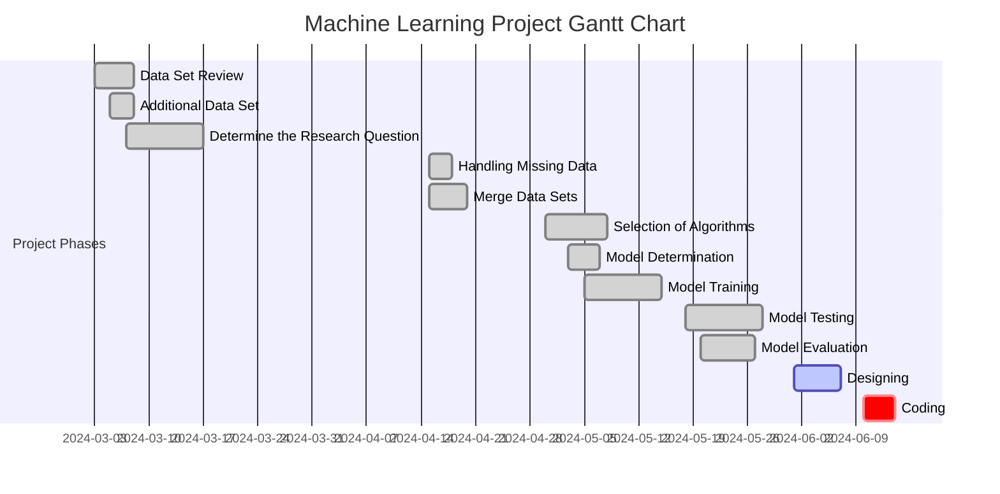

# Project Proposal :Predicting Viewer Ratings for Movies and TV Shows on Netflix

## Introduction

The entertainment industry is changing quickly, and it's important to know what makes a production successful. The objective of our study is to analyze and measure the impact of particular actors and directors on the box office performance of motion pictures and television series. 
This initiative aims to provide insights that can help creators and distributors make strategic decisions by analyzing how these key figures affect metrics such as gross income and IMDb ratings.

## Overview
This research proposal outlines a study aimed at predicting viewer ratings for movies and TV shows on Netflix. The prediction is based on certain features such as director reputation, gross income from previous works, and genre classifications. The core hypothesis is that these features significantly influence viewer ratings and can be used to construct a predictive model.

## Research Questions
We aim to answer the following research questions:

 - Can we predict viewer ratings for movies and TV shows on Netflix using features such as director reputation (IMDb ratings and gross income) and genre classifications?

 - What is the impact of a particular cast or director on the success (IMDB score, gross) of the film/series?
   
This questions were chosen because:

Director reputation and genre classification are believed to be strong indicators of a title's success and viewer ratings.Understanding these relationships can help Netflix curate and recommend content more effectively.It can also provide content producers and distributors with the information they need to make strategic decisions by determining the impact actors and directors have on the success of films and series.

## Expected Outcomes
The study is expected to reveal the impact of director reputation and genre on audience ratings and analyze the success of the particular cast and director. A predictive model will be developed to predict viewer ratings with reasonable accuracy.

  ## Data Sources
The datasets used in this study include:

Netflix titles and associated metadata (netflix_titles.csv)

Movie and TV show titles with viewer ratings and popularity scores (titles.csv)

Credits for the cast and crew involved in the titles (credits.csv)

IMDb top 1000 movies with series titles and gross earnings (imdb_top_1000.csv)

## Preprocessing Steps
1. **Data Cleaning and Merging:**
 - Imported necessary libraries and loaded datasets using pandas.
 - Standardized the 'title' field across datasets to ensure consistency.
 - Cleaned the 'title' fields to remove punctuation and whitespace.
 - Applied a custom function to remove the suffix 'the movie' from titles.
 - Merged datasets on the 'title' and 'id' fields to create a combined DataFrame.
 - Checked for mismatches in the 'title' fields post-merge and found no discrepancies.
 - Dropped redundant columns post-merge, such as 'Series_Title'.

2. **Handling Missing Values:**
 - Identified columns with missing values using isnull().sum().
 - Filled missing values in 'Imdb_Score' with the column's mean.
 - Filled missing values in 'Imdb_Votes' with the column's median.
 - Filled missing values in 'Tmdb_Score' with the column's mean.
 - Replaced missing 'Director' and 'Character' entries with 'Unknown'.
 - Filled missing 'Cast' entries with the most common cast member.
 - Converted 'Gross' to floats after removing commas, and filled missing values with the median gross income.

3. **Data Transformation and Analysis:**
 - Renamed columns to have title casing.
 - Checked for and addressed duplicate rows.
 - Exploratory Data Analysis (EDA)
 - Visualized the correlation between IMDb Score and TMDB Score using a scatter plot.
 - Analyzed audience scores by genre with a box plot.
 - Investigated the top 10 directors by average IMDb Score using a bar plot.
 - Explored the relationship between gross income and IMDb Score with a scatter plot.

   ## Next Steps
 - Complete a more in-depth EDA to uncover additional insights and refine features for the predictive model.

 - Implement feature engineering techniques to improve model performance.

 - Select appropriate machine learning algorithms for the prediction task.

 - Train and evaluate the predictive model using cross-validation and grid search for hyperparameter tuning.

 - Document the findings and develop a communicative report with visualizations and interpretations.
    ## DATASTORYTELLING:
   The film industry has undergone great changes over time. With the rise of digital platforms, movies can be watched not only in the cinema but also in our homes. This transformation also affected the income sources and success criteria of films. In this project, we aim to better understand the dynamics of the film industry by examining the IMDb scores of certain actors and directors and their impact on the revenues of films.

 
   ## Data Analysis: Correlation Between IMDb and TMDB Scores

The scatter plot below illustrates the correlation between IMDb and TMDB scores for various movies. The plot helps to visualize the relationship between these two popular movie rating platforms.

*Figure 2.9: Correlation Between IMDb and TMDB Scores*

2.  **Journey with Data:**
2.1. IMDb and TMDB Scores:
IMDb and TMDB are the two platforms most frequently used by movie viewers. It might be interesting to see how the scores of these two platforms relate to each other. In the chart below you can find an analysis of how compatible these two scoring systems are.

## Contributors:
 Duygu Pınar Özer - 121203030
 
 Elif Yener - 120203008
 
 Feyza Cezik - 121203052
 
 İrem Yürekli - 121203067
